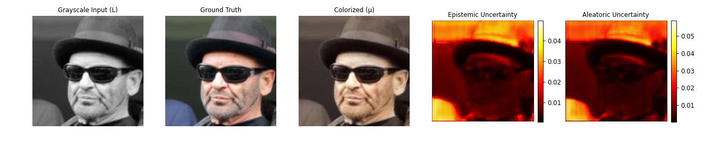

## Evidential Deep Learning (EDL) for Image Reconstruction

Uses PyTorch to train an evidential U-Net for grayscale -> RGB reconstruction using CelebA dataset. Read the [deep evidential regression](https://www.mit.edu/~amini/pubs/pdf/deep-evidential-regression.pdf) paper for info on layer and loss details. Learns the parameters to the [Normal Inverse Gamma distribution](https://en.wikipedia.org/wiki/Normal-inverse-gamma_distribution) (meta-distribution for Gaussian likelihood) to capture both [aleatoric and epistemic uncertainty](https://en.wikipedia.org/wiki/Uncertainty_quantification) in one pass.

Install the CelebA dataset [here](https://mmlab.ie.cuhk.edu.hk/projects/CelebA.html) then put into `data/` folder. Install dependencies then install the project as a package: `pip install -e .` Run `main.py` which contains some base code to train and evaluate the model. Examples are included in the `examples/` folder.

Thanks to [this](https://github.com/teddykoker/evidential-learning-pytorch) repo for the PyTorch implementation of EDL layers + loss. I added an 2D NIG conv layer on top of this. 

License: MIT